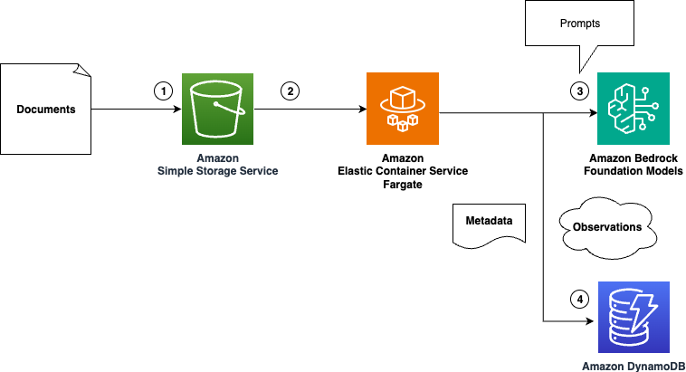

# Observer

<b>tl; dr</b> - Observer is a collecting observations from data. 

Observations are useful bits of data related to questions that you define that is extracted from the data you pass in. 
Use Observer to process pdf (and maybe someday other files) into formats like csv (and later parqet) to turn unstructured
documents into structured observations that you can use directly or through your application.

## What does it do?

Observer takes an unstructured data file as input (like a pdf) and outputs a list of Observation objects. Each observation 
includes standard fields that are extracted from the document together with metadata like the document name and page number. 

## Where does Observer fit?

You can use Observer as a local script for ad-hoc extractions or as a component in data ingestion pipelines. The CLI 
provides simple interface that you can use in evaluation, tuning, and scaled ingestion.

## What does this look like on AWS?

Here is one way. You could use almost any compute environment. Including SageMaker, EC2, Lambda (with potential max run time limitation).



## How do I use it?

### Setup
```bash
virtualenv .venv
source ./.venv/bin/activate
python -m pip install -r requirements.txt
python -m pip install -e . # local install for dev
```

### Usage

Use --help to view available options

```bash
(.venv) localhost % observer --help
Initializing main class
Starting run
Processing arguments
usage: Observer [-h] [-v] [-f FILE] [-t TYPE] [-o OUT] [-j OUT_TYPE] [-q QUESTIONS] [-c COUNT]

A tool for collecting observations from data

options:
  -h, --help            show this help message and exit
  -v, --verbose         Enable verbose outputs
  -f, --file FILE       input file path
  -t, --type TYPE       type of input [pdf] # todo: more
  -o, --out OUT         output file path
  -j, --out-type OUT_TYPE
                        output file format [csv] # todo: more
  -q, --questions QUESTIONS
                        path to a text file with questions for your data
  -c, --count COUNT     maximum questions to include in a prompt

Use --help to see more options
```