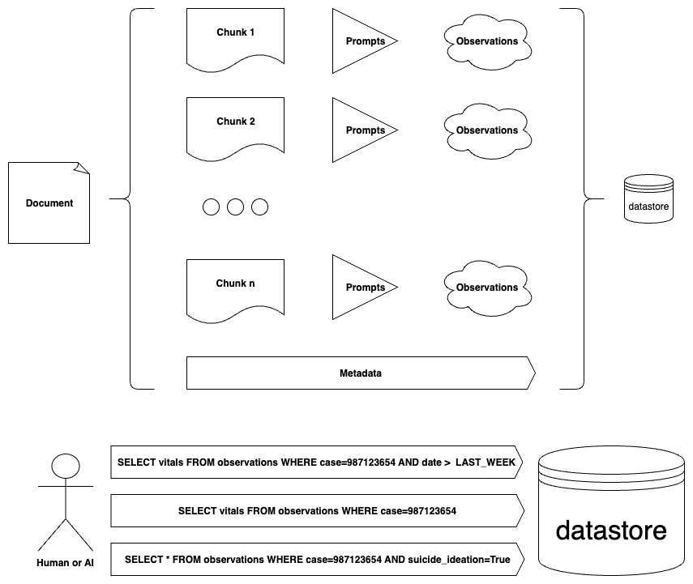

# Observer

<b>tl; dr</b> - Observer is a tool for collecting observations from data. 

Observations are useful bits of data related to questions that you define that is extracted from the data you pass in. 
Use Observer to process pdf (and maybe someday other files) into formats like csv (and later parqet) to turn unstructured
documents into structured observations that you can query and use directly or through your application. When you output to a format like csv or parquet, observations are the row level records.

## What does it do?

Observer takes an unstructured data file as input (like a pdf) and outputs a list of Observation objects. Each observation 
includes standard fields that are extracted from the document together with metadata like the document name and page number. 

## So what?

You can populate observations into a datastore and make them available to your human and AI users. They can be queried based on metadata like date and the specific questions they relate too. You can define question sets that represent thought process of a subject-matter-expert coming up to speed on this case to start mapping a document into useful observations.



## Where does it fit?

You can use Observer as a local script for ad-hoc extractions or as a component in data ingestion pipelines. The CLI 
provides simple interface that you can use in evaluation, tuning, and scaled ingestion.

## What does this look like on AWS?

Here is one way. You could use almost any compute environment. Including SageMaker, EC2, Lambda (with potential max run time limitation).


## How do I use it?

### Setup
```bash
virtualenv .venv
source ./.venv/bin/activate
python -m pip install -r requirements.txt
python -m pip install -e . # local install for dev
```

### Usage

Observer uses AWS credentials from the runtime environment. AWS IAM lets you securely manage identities and access to AWS services and resources. Credentials can be managed using the AWS CLI for local operations or by adding IAM permissions to the compute runtime (ie: AWS Lambda, ECS, EC2, or SageMaker). A best practice is to use separate roles for local development and automated pipelines to mitigate risk of data corruption.

Use --help to view available options

```bash
(.venv) localhost % observer --help
Initializing main class
Starting run
Processing arguments
usage: Observer [-h] [-v] [-f FILE] [-t TYPE] [-o OUT] [-j OUT_TYPE] [-q QUESTIONS] [-c COUNT]

A tool for collecting observations from data

options:
  -h, --help            show this help message and exit
  -v, --verbose         Enable verbose outputs
  -f, --file FILE       input file path
  -t, --type TYPE       type of input [pdf] # todo: more
  -o, --out OUT         output file path
  -j, --out-type OUT_TYPE
                        output file format [csv] # todo: more
  -q, --questions QUESTIONS
                        path to a text file with questions for your data
  -c, --count COUNT     maximum questions to include in a prompt

Use --help to see more options
```

By example

```bash
(.venv) localhost % observer -v \
  -f sample-record-2.pdf \
  -t pdf \
  -c 1 \
  -o sample-record-2-auto-filtered-out.csv \
  -q observer/examples/auto-accident.txt
```